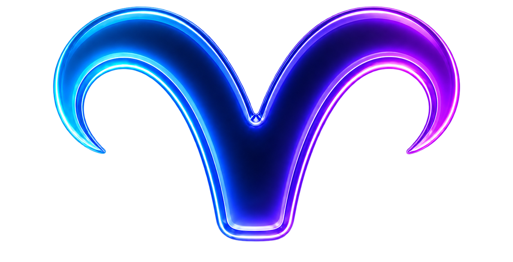

<div align="center">
<h1><picture><source media="(prefers-color-scheme: light)" srcset="assets/goat-readme-light.svg"></picture><br>GOAT</h1>

[](https://github.com/goatsoft/GOAT/actions/workflows/ci.yml?query=branch%3Amain)
[](https://github.com/goatsoft/GOAT/releases/latest)
[](https://github.com/goatsoft/GOAT/releases)
[](https://goatherd.dev/Getting-Started#requirements)
[](https://goatherd.dev/Getting-Started#requirements)
[](LICENSE)

**A native AI workspace for Mac, built around local models and permissions you control.**

[Website](https://goatapp.dev/) · [Get started](https://goatherd.dev/Getting-Started) · [Documentation](https://goatherd.dev/) · [Contribute](https://goatherd.dev/Contributing)

</div>

GOAT connects a compatible model engine to project files, tools and memory. Organise work in Pens, inspect the actions behind a response and guide an active chat with Lead. The engine you choose runs the model; GOAT provides the workspace around it.

**0.1.1 (Kid) is available for Mac.** [Download GOAT](https://github.com/goatsoft/GOAT/releases/download/v0.1.1/GOAT-0.1.1.dmg) or read the [release notes](https://github.com/goatsoft/GOAT/releases/tag/v0.1.1). The official download is signed and notarized. Start with the [installation guide](https://goatherd.dev/Getting-Started), and check [known issues](https://goatherd.dev/KNOWN-ISSUES) for current limitations.

**New in 0.1.1:** sidebar fixes, preference reset, recoverable uninstall and a revised Finder installer. See the [maintenance scope and M7 plan](docs/ROADMAP.md).

## From conversation to project work

- **Work on code.** Inspect files, make approved edits and run permitted non-interactive commands. Expand grouped tool activity and use Lead to guide the next step after the current action completes.
- **Give each project a Pen.** Keep related chats, instructions and workspace access together, with file and command permissions scoped to a chat or Pen.
- **Use inspectable memory.** Choose local Markdown or LLM Wiki memory, or connect an optional Hindsight service. Global and Pen memory have separate scopes.
- **Preview useful output.** Open supported HTML, SVG, Markdown and Mermaid documents in the Paddock, inspect their source and save the result.
- **Add tools and skills.** Manage built-in extensions, connect MCP servers and install declarative GOATed packages with reusable content.
- **Control connections.** Use JUDAS policies for supported app connections and review activity when troubleshooting.

GOAT also includes streaming chat, capability-aware effort presets, engine-supplied usage statistics, themes, reading preferences and an optional same-user local CLI/API.

## Get started

You need an **Apple Silicon Mac running macOS 26 or later** and a compatible model engine. Model memory requirements depend on the model and engine you choose. GOAT does not include model weights or run inference in-process.

[Download the DMG](https://github.com/goatsoft/GOAT/releases/download/v0.1.1/GOAT-0.1.1.dmg), open it and drag GOAT into Applications. Follow [Getting started](https://goatherd.dev/Getting-Started) and the [engine compatibility reference](https://goatherd.dev/reference/engines). Configure your engine’s actual endpoint and credentials, select a model and send a first message. For project work, [create a Pen](https://goatherd.dev/how-to/CREATE-A-PEN) and review its workspace permissions.

To build from source, install the required Xcode toolchain and XcodeGen, then:

```sh
git clone https://github.com/goatsoft/GOAT.git
cd GOAT
make gen
make build
```

[Contributing](https://goatherd.dev/Contributing) covers the toolchain, verification and launch procedure. Never restart GOAT while a chat or command is active.

## Privacy and control

GOAT has no built-in analytics, advertising or automatic update checks. Chats and local-provider memory are stored on your Mac. No GOAT account is required.

Your engine and connected services determine where processing happens. A remote engine, MCP server or Hindsight service can receive data used for its work. Preview content and explicitly approved network-enabled commands can also communicate externally. JUDAS governs supported GOAT connection paths; it is not an OS firewall.

Read [Privacy](https://goatherd.dev/PRIVACY), [connection controls](https://goatherd.dev/JUDAS) and the [security policy](SECURITY.md) for the boundaries and reporting process.

## Help build GOAT

Contributions are welcome across code, documentation, compatibility testing, accessibility and examples. Start with [Contributing](https://goatherd.dev/Contributing), the [architecture overview](https://goatherd.dev/Architecture) and [module reference](https://goatherd.dev/MODULES). Follow the [Code of Conduct](CODE_OF_CONDUCT.md).

Financial support helps sustain maintenance and development. [Support GOAT](https://www.buymeacoffee.com/josephblythe) through Buy Me a Coffee. For general enquiries or sponsorship conversations, email [baa@goatapp.dev](mailto:baa@goatapp.dev).

## Licence

Source code, documentation and examples use the [MIT licence](LICENSE). Artwork and branding have [separate terms](LICENSE-ART.md). [Third-party notices](THIRD-PARTY-NOTICES.md) describe dependencies and bundled assets.
