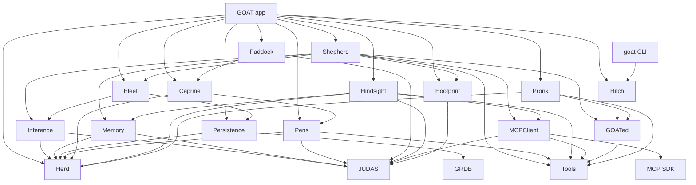

# Architecture

GOAT is a native macOS app composed from 17 Swift library modules and the `goat` command-line executable. One local package resolves dependencies; separate targets enforce domain imports. The complete [module catalogue](MODULES.md) records ownership, public interfaces, dependencies and validation. [ADR-0054](adrs/0054-first-class-domain-modules.md) explains this structure.

## Ownership

The app is the composition root. It creates services, implements the environment and tool-source protocols, and connects them to SwiftUI screens. A module owns its domain state and operations; the app owns navigation and presentation that need several domains at once.

- **Bleet** owns chat sessions, messages and incremental live metrics. Its screens live in `App/Sources/Bleet`.
- **Shepherd** owns one active chat turn, its generation worker, tool rounds and durable handover.
- **Pens** owns folder-backed project metadata and scope. **Herd** owns local filesystem services, credentials, attachments and optional user workspace bindings.
- **Persistence** owns the chat database and records. **Memory** owns provider-neutral memory contracts and local stores; **Hindsight** adapts the optional external memory service.
- **Tools** owns neutral tool values. **MCPClient** adapts the external MCP SDK. **GOATed** owns scoped extension capabilities. **Pronk** demonstrates those capabilities without becoming a dependency of the runtime.
- **Hitch** exposes the running app's operations over a private Unix socket.
- **JUDAS** owns connection policy and revocation. **Hoofprint** owns bounded in-memory activity and local Instruments signposts.
- **Caprine** owns themes and visual primitives. **Paddock** owns artifact values and its restricted WebKit preview host.

Settings, the permission sheet, memory graph presentation, Stats, onboarding and app-aware design controls are host features. They are documented components, not additional libraries with empty interfaces.

`AppModel` keeps composition and observable state; its responsibility-specific extensions implement startup, engine management, chat/Pen persistence, presentation and generation. `StartupDiskLoader` owns startup disk reads and migrations. `MemoryModel` keeps configuration and provider authority; `MemoryToolHandler` owns tool decoding and bounded results, with separate browsing, configuration, Hindsight, retention and feedback implementations. `ExtensionRegistrationController` serializes optional Hindsight registration and teardown. See [ADR-0077](adrs/0077-host-coordination-and-resource-lifetimes.md).

## Dependency direction

Arrows mean imports. The app composes all libraries; no library imports the app. See the catalogue for the exact dependency list, checked against `Modules/Package.swift`.



`import GRDB` is confined to Persistence; `import MCP` to MCPClient. The app uses record and adapter APIs. Tools and JUDAS have no local module dependencies. Backend modules do not import SwiftUI, AppKit or WebKit. Caprine owns the conversion from serializable Pen colour values to SwiftUI colours.

The module check rejects cycles, undeclared imports, adapter leakage and app imports from libraries. It is a maintenance guard, not an OS security boundary. Swift's type checker and package target dependencies supply the compile-time boundary.

## A chat turn

1. The GUI or Hitch asks the host to send. Shepherd reserves the single app-wide turn before attachment preparation or other asynchronous work.
2. The host resolves the selected engine, Pen instructions, memory scope and extension context. Global and Pen memory are exclusive. Moving a chat changes future writes, never silently copies old memory.
3. Shepherd captures a Sendable snapshot. Its worker reads attachment bytes and prepares the prompt off MainActor. `PromptBudgeter` selects whole context entries under deterministic limits. Provider content is data, not authorization.
4. Inference normalizes the configured engine's HTTP/SSE response into typed generation events. JUDAS admits the connection and rejects redirects. Display publications are coalesced; persistence checkpoints remain about one second apart.
5. Tool calls pass through the host router. MCP approval is bound to the current server configuration and capability token; GOATed uses scoped handles. Reconnection, revocation or stale ownership fails closed. There is no fixed tool-round cap. Lead instructions persist in the chat and apply after the current response/action/approval; later unstarted actions may be superseded. Stop interrupts.
6. The final assistant row must persist before completion and memory write-back. An explicitly optional remote context failure can degrade to chat without that context; local-store invariant failures stop preparation. The `/handoff` command has its own durable lifecycle.
7. Stop, engine changes and shutdown cancel owned work. Results are published only while the originating turn or engine revision remains current.

Shepherd uses `ShepherdEnvironment` and `ShepherdToolSource`, both implemented by the host and replaceable by fakes. Its route still carries an MCP capability token: moving that opaque authorization identity into a neutral contract is a possible later refinement, not a reason to weaken the current checks.

Herder provides five native file/navigation tools and three command-job tools for a configured Pen. Creation/edits use separate once/chat/Pen file grants; commands use an owner-managed executable whitelist bound to physical workspace/executable identity, with requested network access tracked separately. Any arguments and custom scripts are supported within the command sandbox. A network-enabled grant also covers offline invocation; it never silently enables networking. Command jobs use isolated home/cache directories, bounded output/deadlines and host-liveness cleanup. The sandbox-exec dependency and process-group limits are recorded in [ADR-0070](adrs/0070-confined-pen-command-jobs.md).

Prompt-budget policy v3 can replace older completed tool groups with labelled data excerpts while preserving the latest two groups exactly. Stored transcript data stays unchanged. Bleet projects consecutive tool rounds into expandable activity groups inside its 40-message measured window, keeping Lead/final replies separate and errors visible. Live throughput includes coalesced generated tool-input bytes; waiting, generation and tool execution have distinct display states. See [ADRs 0069–0074](adrs/README.md).

## Connection and data boundaries

The Herd Guarantee means GOAT's own code does not phone home. There is no app analytics, update ping or self-initiated cloud dependency. Explicitly configured engines, MCP and Hindsight services, permitted preview content, and owner-approved Pen commands can use the network for requested work.

JUDAS applies configured, local-networks-only or blocked policy to managed connections. Configured LAN and Thunderbolt services use the same local-address classifier as Hindsight endpoint validation; macOS local-network permission remains required ([ADR-0055](adrs/0055-local-network-service-authority.md)). Mode changes revoke registrations, cancel active transports and retire preview documents. Restricted modes reject MCP subprocesses because GOAT cannot confine their network traffic. Native bundled extensions are trusted Swift code, not sandboxed third-party binaries. Independent browsers, servers and OS traffic remain outside JUDAS.

Paddock uses ephemeral WebKit storage and bounded bundled rendering. Policy changes replace its preview host. Deliberate external links pass through policy before a browser hand-off; subsequent browser traffic is outside GOAT's control. No arbitrary script execution button or third-party preview renderer is introduced.

Hitch stays off by default. Its socket and owner lock are private, peers must have the same user ID, frames and concurrent clients are bounded, and replay protection is session-local. The CLI cannot read credentials, edit security policy or bypass approvals. The app owns persistence and generation.

Herd and Memory enforce bounded local reads, owner-only secret files, validated paths and fail-closed stores. Memory's secure filesystem uses descriptor-relative operations. Hoofprint holds the latest 500 entries only in memory. It is neither durable audit storage nor remote telemetry.

## Storage compatibility

The home override, default `~/.goat`, database location, extension IDs and command/socket names remain stable. SQLite migration v10 adds scoped native file grants; the separate command whitelist persists in UserDefaults with backward-compatible optional executable paths. Startup preserves saved tool results and adds visible notices for interrupted or unknown outcomes. No user files or memory banks are migrated by these changes.

```text
~/.goat/
├── config/                    # engines, credentials, MCP, memory and themes
├── memory/                    # Global memory
├── skills/                    # Global skill documents
├── extensions/pronk/           # scoped fictional-goat state
├── control/                   # goat.sock and owner.lock while Hitch is enabled
└── projects/<name>_<uuid>/     # Pen metadata, instructions, skills and memory

~/Library/Application Support/GOAT/
├── goat.sqlite
└── Attachments/
```

Themes remain GTF v1. Fonts are local declarations, not bundled downloads. The professional/1337 presentation preference never participates in functional authorization.

## Media direction

**Tether is proposed, not implemented.** It owns a `MediaDraft` and the contextual Image/Video controls. [ADR-0029](adrs/0029-contextual-media-workspaces-and-tether.md) also proposes a media engine protocol and a separate job coordinator for progress, cancellation, concurrency and durable results. Media jobs do not become chat token events. Bleet attachments and Paddock previews are existing features with different ownership.

## Validation and remaining work

`make verify` runs the module and JUDAS boundary checks, formatting, package tests and hosted app tests. `make build` builds the app and `make cli` builds Hitch's executable. The website and docs build from `web/` with `npm run build:all`.

Website and docs Aurora decorations share a page-owned WebGPU worker. Components own canvas leases and visibility; the worker owns the device, pipeline and bounded drawing schedule. Unsupported or failed worker rendering falls back without blocking navigation. The HTTPS development command serves both sites at one origin for secure browser capability testing. See [ADR-0079](adrs/0079-shared-aurora-worker.md) and the [website development guide](../web/README.md).

The [release checklist](RELEASE-CHECKLIST.md) records qualification requirements. [ADR-0056](adrs/0056-bounded-rendering-and-responsive-io.md) explains bounded preview preparation, cache eviction, event-driven activity and blocking socket I/O ownership. SQLite remains the durable authority. Passing fixture tests does not establish every live service combination, clean-machine installation or signing/notarization.

Chat text/code attachments use validated `.goatdoc` envelopes in the existing attachment store. Shepherd expands their text during prompt preparation. Inline HTML/SVG/Mermaid artifacts and throttled streaming Markdown use the existing bounded rendering paths. See [ADR-0075](adrs/0075-chat-attachments-and-inline-artifacts.md).

Hindsight session health is independent of individual memory request success. Connection checks share an owned attempt and reuse healthy transports; scope recovery preserves extension and JUDAS authority. See [ADR-0076](adrs/0076-hindsight-health-and-session-ownership.md).

Fresh installations keep an empty engine list and open Engine settings after local startup. Existing lists and explicit legacy connections retain their settings. The first saved engine becomes active after its profile and optional credential have been written. See [ADR-0080](adrs/0080-explicit-first-engine-setup.md).
